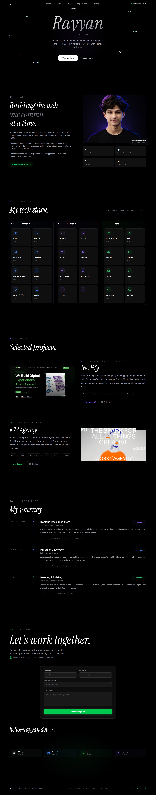

<div align="center">


# Rayyan — Developer Portfolio

**A modern, animated full stack developer portfolio built with React, GSAP, and Framer Motion.**  
Featuring a custom cursor, GSAP page loader, ScrollTrigger animations, scramble text effects, and smooth scroll — all in one production-grade site.

[](https://your-portfolio.vercel.app)
[](https://github.com/rayan9476/rayyan-portfolio)



</div>

---

## ✨ Features

### Animations & Interactions

- **Page Loader** — GSAP timeline with letter-by-letter name reveal, gradient line draw, colored dots animation, and split-panel exit
- **Custom Cursor** — GSAP ticker-driven crosshair + ring follower with section-aware color changes (blue → violet → green) and `VIEW` text on project hover
- **Cursor Image Reveal** — Hero section reveals a background image that follows cursor with smooth lag and parallax depth
- **Smooth Scroll** — Lenis with `autoRaf: true`, exposed via `window.__lenis`
- **ScrollTrigger** — GSAP experience timeline line draw, project image wipe reveal + parallax
- **Framer Motion layoutId** — smooth shared element transitions on project cards
- **Scramble Text** — Skills section letters randomize then snap to real text on scroll enter
- **Count-up animations** — Custom `useCountUp` hook with easing, supports `K`, `M`, `+` suffixes
- **Scroll-triggered entrance** — `whileInView` on all section cards with staggered delays

### Sections

- **Hero** — Fullscreen with floating tech labels, mouse parallax, cursor image reveal, gradient name, animated CTA buttons
- **About** — Two-column layout with animated text, floating location card, stats grid
- **Skills** — Three-column card grid with icons, animated progress bars, scramble text on scroll
- **Projects** — Alternating large cards with image wipe reveal, parallax, hover overlays
- **Experience** — Vertical timeline with GSAP SVG line draw animation
- **Contact** — Scramble heading, big email CTA, contact form with validation + Google Sheets, social links

---

## 🛠 Tech Stack

| Technology           | Version | Purpose                           |
| -------------------- | ------- | --------------------------------- |
| React                | 18      | UI framework                      |
| Vite                 | 5       | Build tool & dev server           |
| Tailwind CSS         | v4      | Utility-first styling             |
| Framer Motion        | latest  | Page animations, layoutId         |
| GSAP + ScrollTrigger | latest  | Cursor, loader, scroll animations |
| Lenis                | latest  | Smooth scroll                     |
| React Router DOM     | v6      | Client-side routing               |
| React Icons          | latest  | Icon library                      |

---

## 📁 Project Structure

```
rayyan-portfolio/
├── public/
│   ├── favicon.ico
│   ├── favicon-16x16.png
│   ├── favicon-32x32.png
│   ├── favicon-48x48.png
│   ├── favicon-96x96.png
│   ├── apple-touch-icon.png
│   ├── android-chrome-192x192.png
│   ├── android-chrome-512x512.png
│   ├── icon-256x256.png
│   ├── icons.svg
│   ├── site-logo.png
│   ├── site.webmanifest
│   ├── sitemap.xml
│   └── robots.txt
├── src/
│   ├── assets/
│   │   └── HeroSection.png
│   ├── components/
│   │   ├── cursor/
│   │   │   └── CustomCursor.jsx     ← GSAP section-aware cursor
│   │   ├── hooks/
│   │   │   ├── useFakeScrollbar.js  ← Custom scrollbar synced to scroll position
│   │   │   ├── useScrollNavigation.js
│   │   │   └── useScrollTo.js       ← Lenis smooth scroll to section
│   │   ├── layout/
│   │   │   ├── Footer.jsx
│   │   │   └── Navbar.jsx           ← Fixed nav with active section detection
│   │   ├── loader/
│   │   │   └── PageLoader.jsx       ← GSAP letter reveal + split exit
│   │   ├── sections/
│   │   │   ├── About.jsx
│   │   │   ├── Contact.jsx
│   │   │   ├── Experience.jsx
│   │   │   ├── Hero.jsx
│   │   │   ├── Projects.jsx
│   │   │   └── Skills.jsx
│   │   └── ui/
│   │       └── SectionLabel.jsx
│   ├── context/
│   │   └── AppContext.jsx
│   ├── lib/
│   │   └── motion.js                ← Framer Motion variants
│   ├── pages/
│   │   └── HomePage.jsx
│   ├── App.jsx
│   ├── index.css
│   └── main.jsx
├── .gitignore
├── eslint.config.js
├── index.html
├── package.json
├── package-lock.json
├── README.md
└── vite.config.js
```

---

## 🚀 Getting Started

### Prerequisites

- Node.js 18+
- npm or yarn

### Installation

```bash
# Clone the repo
git clone https://github.com/rayan9476/rayyan-portfolio.git
cd rayyan-portfolio

# Install dependencies
npm install
```

### Development

```bash
npm run dev
```

Open [http://localhost:5173](http://localhost:5173)

### Production Build

```bash
npm run build
npm run preview
```

---

## 📦 Dependencies

```bash
# Install all at once
npm install gsap framer-motion lenis react-router-dom react-icons

# Dev dependencies
npm install -D tailwindcss postcss autoprefixer @vitejs/plugin-react vite
```

---

## 🎨 Design System

### Color Palette

| Role           | Color     | Usage            |
| -------------- | --------- | ---------------- |
| Background     | `#000`    | Main background  |
| Surface        | `#111111` | Card backgrounds |
| Text Primary   | `#F5F5F5` | Headings         |
| Text Secondary | `#A1A1AA` | Body text        |
| Blue accent    | `#3B82F6` | Skills section   |
| Violet accent  | `#8B5CF6` | Projects section |
| Green accent   | `#22C55E` | Contact section  |

### Typography

- **Display** — `Instrument Serif` (italic) — hero name, section headings
- **Body** — `Inter` — all other text
- **Mono** — system mono — labels, tags, section numbers

### Section Accent Colors

Each section owns one accent color — cursor ring changes color as you scroll between sections:

```
Home / About   →  White  #F5F5F5
Skills         →  Blue   #3B82F6
Projects       →  Violet #8B5CF6
Experience     →  White  #F5F5F5
Contact        →  Green  #22C55E
```

---

## ⚡ Performance Optimizations

### CSS

- ✅ No `background-attachment: fixed` — prevents scroll repaint
- ✅ `will-change: transform` on animated elements only
- ✅ `-webkit-font-smoothing: antialiased` on floating elements — prevents text flicker
- ✅ `backfaceVisibility: hidden` on Framer Motion floating cards

### JavaScript

- ✅ All below-fold sections use `React.lazy` + `Suspense`
- ✅ Custom cursor uses `lastTarget` cache — `getComputedStyle` only on element change
- ✅ Lenis `autoRaf: true` — single clean RAF loop
- ✅ `useCountUp` cancels `requestAnimationFrame` on unmount
- ✅ GSAP `context()` with `revert()` cleanup on all ScrollTrigger instances
- ✅ `overwrite: "auto"` on all GSAP tweens

---

## 🌐 Deployment

### Vercel (Recommended)

```bash
# Option 1 — CLI
npm i -g vercel
vercel

# Option 2 — Connect GitHub repo to vercel.com
# Auto-deploys on every push to main
```

### Netlify

```bash
npm run build
# Drag & drop dist/ folder to netlify.com/drop
```

Add `public/_redirects` for React Router:

```
/*    /index.html   200
```

---

## 🌍 Browser Support

| Browser       | Support | Notes                |
| ------------- | ------- | -------------------- |
| Chrome 90+    | ✅ Full | —                    |
| Firefox 88+   | ✅ Full | —                    |
| Safari 14+    | ✅ Full | —                    |
| Edge 90+      | ✅ Full | —                    |
| Mobile Chrome | ✅ Full | Cursor auto-disabled |
| Mobile Safari | ✅ Full | Cursor auto-disabled |

> Custom cursor disabled on touch devices via `(pointer: fine)` media query automatically.

---

## 📋 Changelog

### v1.0.0 — Initial Release

- Hero with cursor image reveal + floating tech labels + mouse parallax
- GSAP page loader with letter reveal + split panel exit
- Section-aware custom cursor with `VIEW` text on project hover
- Skills section with scramble text + animated progress bars
- Projects section with GSAP image wipe reveal + scroll parallax
- Experience timeline with GSAP SVG line draw
- Contact section with scramble heading + Google Sheets form
- Lenis smooth scroll throughout
- Full SEO — meta tags, OG, Twitter Card, Schema.org, sitemap, robots.txt
- All breakpoints — responsive from mobile to 3xl ultrawide

---

## 👤 Author

**Rayyan** — Full Stack Developer based in Karachi, Pakistan

[](https://your-portfolio.vercel.app)
[](https://linkedin.com/in/yourusername)
[](https://fiverr.com/yourusername)
[](mailto:hellorayyan.dev@gmail.com)

---

<div align="center">


_Built with React + Vite + Tailwind CSS + Framer Motion + GSAP + Lenis_

</div>
